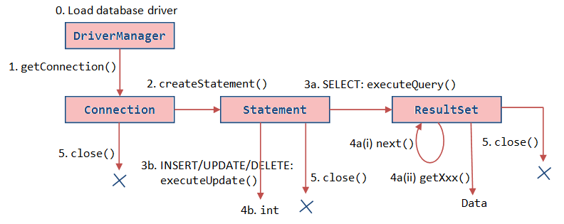

= InfoArchive SIP SDK Lab
Tord Svensson;Ray Sinnema <rsinnema@opentext.com>

ifndef::sourcedir[:sourcedir: ../../..]

== Overview

This lab contains exercises that together should take about 40-60 minutes.

IMPORTANT: We assume you have the lab code ready to go in an IDE with which you are comfortable. If this is not
the case, you may need more time to get set up. Your instructor or one of the other students can probably help you with 
that.

To complete an exercise, you make a unit test pass that we've provided for you. The purpose of each test will be 
explained below. You can run a test as many times as you like to check your progress. A passing test proves that you 
have successfully implemented the required functionality for the exercise and are thus ready to move on to the next
exercise.

The exercises start out simple and move to progressively more complex use cases.

You'll find the source code for the exercises in `$LAB_HOME/lab/java/`, where `$LAB_HOME` is the 
directory in which the lab resides. Additional resource files are in `$LAB_HOME/lab/resources/`.

For each exercise there is a corresponding class named `Exercise<n>`, when `<n>` is the number of the exercise. This 
class lives in the package `com.emc.ia.sipsdk.lab.exercise<n>`. The exercise class contains a method 
`performAssignment()` that you must implement. It also contains code to check whether you did the work correctly. The
latter code should not be modified and is marked as such.

TIP: You may want to pair up with someone else and do the exercises together, in particular if your environment is not 
set up properly or you are not very proficient in coding.

<<<

== Exercise 1

Introduction:: The first exercise is just to get you comfortable with the lab process.

Objective:: Generate a SIP from a single POJO.

Test to run:: `com.emc.ia.sipsdk.lab.exercise1.Exercise1`

=== Guidance
* Run the test. In Eclipse, for instance, you would use the keyboard shortcut `Shift+Alt+X T` or use the context menu
as follows:

* The test should fail, because you haven't written any code yet:

* The required code is already there, but commented out. Remove the comment markers `/\*` and `*/` in both `Exercise1`
and `Country`.
* Run the test again. It should now pass:

* *Congratulations!* You've just assembled your first SIP with the SDK :-)
* Review the provided code carefully, because you will need to understand it to be able to complete the upcoming 
exercises. The Javadoc for the various interfaces and classes may help you with that.
* The `Country` class is our domain object. It is a _Plain Old Java Object_ (POJO) that holds the required
information. We've made the class immutable by passing in all information in the constructor and providing only
getters. This is not required, but a good practice to follow if you can.
* The meat of the code is in `Exercise1.performAssignment()`:
** We start with providing packaging information, which will end up in the `eas_sip.xml` entry in the ZIP file.
** Then we map our `Country` domain object to XML for inclusion in `eas_pdi.xml`.
** We use the `SipAssembler.forPdi()` factory method to create a SIP assembler. Check out the other `forXXX()`
methods, because you'll need them in later exercises.
** We wrap the `SipAssembler` in a `FileGenerator` for convenience. In Exercise 3 we'll see how to use the 
`SipAssembler` directly.
** We then create the instance of our domain object that we want to archive, in this case the beautiful country of
http://www.visitsweden.com/sweden/[Sweden].
** Finally, we let the `FileGenerator` generate the SIP. 

TIP: If you find anything unclear or see other opportunities for improvement, please report them to your instructor so
we can address them in future versions of this lab.

<<<

== Exercise 2

Introduction:: The previous exercise built up an in-memory XML document to hold the _Preservation Description
Information_ (PDI). Sometimes it's more convenient to use a template engine to generate the PDI XML, especially when
you're already using a template engine in your project. You may also be able to achieve better performance this way.

 
Objective:: Generate a SIP containing PDI generated from a template.

Test to run:: `com.emc.ia.sipsdk.lab.exercise2.Exercise2`

=== Guidance
* We're going to achieve exactly the same as in the previous exercise, so you may start out with copying code from
`Exercise1` into `Exercise2`. Add an `import` statement to `Exercise2` for accessing the `Country` class.
* Change the `PdiAssembler` from `XmlPdiAssembler` to `TemplatePdiAssembler`.
* You will have to provide a `Template` instance in the constructor. The SDK supports multiple template engines, but
in this lab we will restrict ourselves to http://www.stringtemplate.org/[StringTemplate].
* The `StringTemplate` class emits a fixed header and footer, while each domain object is converted using an actual
template. This template will have access to the domain object using the `model` variable. Variable parts in the
template start and end with `$`. To access the name of a country, for example, you'd write `$model.name$`.
* Provide the header, footer, and template to convert the `Country` domain object to XML.
* Run the test to verify your work.

<<<

== Exercise 3

Introduction:: Now that we have the basics down, we're going to make things a bit more realistic. You don't usually have
your domain objects only in memory; they are likely retrieved from some data source. In this exercise you'll learn how
you can iterate over large data sets without holding everything in memory. To keep things simple, we'll use the 
http://www.h2database.com/html/main.html[H2] in-memory database to hold our data and access it using standard JDBC.
 
 
Objective:: Generate a SIP from data retrieved from a SQL database.

Test to run:: `com.emc.ia.sipsdk.lab.exercise3.Exercise3`

=== Guidance
* Most of the code for this exercise will be the same as for the previous two exercises, but the PDI will now contain
multiple countries. You can start from either `Exercise1` or `Exercise2` and make the required modifications.
* We will no longer use a `FileGenerator` in this exercise, because we want to iterate over a number of countries, as
returned by a SQL query. Replace the `FileGenerator` with direct calls to the `SipAssembler`. Use the Javadoc to
find out which calls to make, or consult the implementation of `FileGenerator` and the `Generator` class from which
it is derived (the source code is included in the jar file and IDEs like Eclipse will show it to you).
* Add a loop over the rows in the `ResultSet` to access the countries returned by the SQL query. Convert each row to 
a `Country` domain object. As you can see in `$LAB_HOME/lab/resources/ia-countries.sql`, the `Country` table has
columns `Code`, `Name` and `Capital` to match the fields in the `Country` domain object. Use the `getString()`
method of `ResultSet` to access the cells of the row by column name.
* Add the domain object to the `SipAssembler` before moving on to the next row in the `ResultSet`.
* As always, run the test to verify your work. (From now on, we'll assume that you'll remember to do that and stop 
pointing it out.)

<<<

== Exercise 4

Introduction:: The previous exercises focused on structured data. In this exercise, we're going to look at unstructured 
data. We'll be archiving images stored in files, but the techniques used are applicable to any kind of binary data and
any kind of source.

Objective:: Generate a SIP with binary content.

Test to run:: `com.emc.ia.sipsdk.lab.exercise4.Exercise4`

=== Guidance
* We'll use a single domain object in this exercise, so start with a copy of either exercise 1 or 2. Unless you were
already familiar with StringTemplate before this lab, we suggest using the `XmlPdiAssembler` of exercise 1.
* For each country, add an `<images>` element to the generated XML. For each image, add an `<image>` element under
`<images>` with an `id` attribute that identifies the image. Its value should match the name of the image in the ZIP.
* If you're using the `XmlPdiAssembler` you may want to use the `XmlBuilder.elements()` method.
* You need to use a different `SipAssembler.forXXX()` factory method to create a `SipAssembler` that also 
processes content.
* Provide the factory method an instance of `CountryToDigitalObjects` to convert a `Country` domain object to 
an iterator over `DigitalObject`.
* Finally, implement `CountryToDigitalObjects`. It should load images for the country from the 
`$LAB_HOME/lab/resources` directory. The `File.listFiles()` method may come in handy here.

<<<

== Exercise 5

Introduction:: So far we've built a single SIP containing all the data we want to archive. In practice, data sets are 
often too large to make that approach feasible.
 

Objective:: Spread data over multiple SIPs.

Test to run:: `com.emc.ia.sipsdk.lab.exercise5.Exercise5`

=== Guidance
* Start with a copy of exercise 3.
* Wrap the `SipAssembler` in a `BatchSipAssembler`.
* Make sure that no more than two countries are added to the same SIP using one of the 
`SipSegmentationStrategy.byXXX()` factory methods.
* Use a suitable `FileSupplier.fromXXX()` method to name the SIPs `sip<n>.zip`, where `<n>` is an increasing 
number.
* Instead of adding domain objects to the `SipAssembler` directly, add them to the `BatchSipAssembler`.

<<<

== Exercise 6

Introduction:: In the previous exercise, all the generated SIPs were part of the same _Data Submission Session_ (DSS),
because they shared the same DSS ID. All SIPs in a DSS are ingested into InfoArchive as a single atomic unit. Sometimes
you'd want to ingest multiple SIPs independently.

Objective:: Spread data over multiple DSSes.

Test to run:: `com.emc.ia.sipsdk.lab.exercise6.Exercise6`

=== Guidance
* Start with a copy of exercise 5.
* Wrap the prototype for the packaging information in a `PackagingInformationFactory` that generates one SIP per
DSS.

* Name the DSS IDs `ex6dss<n>`, where `<n>` is a sequential number starting at 1, by using an instance of
`SequentialDssIdSupplier`.
* Use the factory rather than the protoype in the constructor of `SipAssembler`.
