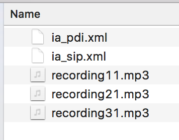

= SIPs and SIP Creation
Tord Svensson;Ray Sinnema <rsinnema@opentext.com>

ifndef::sourcedir[:sourcedir: ../../..]

<<<

== What is a SIP?

* SIP = Submission Information Package
* A file
* A package containing
** manifest / packaging information
** structured data (PDI)
** unstructured data aka files / content

== SIP Formats

InfoArchive supports several SIP formats OOTB and new ones can be added.

|===
|Format |Description

|zip_sip
|A zipped SIP file.

|zip_sip_crypto
|An encrypted zipped SIP file.

|eas_zip_sip
|LEGACY For use when ingesting old SIPs (< 4.0)

|eas_zip_sip_crypto
|LEGACY For use when ingesting old SIPs (< 4.0)

...
|===

<<<

== ZIP SIP Format
* The zip_sip format is the most common.
* A ZIP SIP can have any name and contains:
** Exactly one manifest (packaging information)
*** `ia_sip.xml` / `eas_sip.xml`
*** which must adhere to the `ia_sip.xsd` schema.
** Exactly one PDI:
*** `ia_pdi.xml` / `eas_pdi.xml`
** Any unstructured files (contents).

<<<

== ZIP SIP Example

The below example ZIP SIP contains

* 1 Manifest / Packaging Information
* 1 PDI
* 3 content items

<<<

== Manifest Example

[source,xml]
----
include::samples/ia_sip.xml[]
----
<1> The name of the holding
<2> The id of the DSS
<3> The schema of the data in the PDI contained in this SIP
<4> The sequence number of this SIP inside the DSS
<5> Whether this SIP is the last one in the DSS or not
<6> The number of AIUs inside the SIP

<<<

== PDI Example
[source,xml]
----
include::samples/ia_pdi.xml[]
----

<<<

== InfoArchive Connectors
InfoArchive is _connector agnostic_.

* SIPs can be created in whichever way is best
* A few OOTB tools for common sources:
** Documentum
** SAP
** Sharepoint

== InfoArchive SDK
* To facilitate SIP creation and ingestion we are proud to present the InfoArchive SDK
* Open source under https://www.mozilla.org/en-US/MPL/2.0/[Mozilla Public License 2.0]
* Available from https://github.com/Enterprise-Content-Management/infoarchive-sip-sdk[GitHub]

== Feature Overview
* Assemble SIPs from Plain Old Java Objects (POJOs)
** Incrementally build SIP to support huge files
** Build PDI using fluent XML builder or template
** Multiple segmentation strategies
** Multiple DSS ID naming strategies
* Ingest SIPs into InfoArchive

<<<

== Adding the dependency

=== Gradle

[source,groovy]
----
include::samples/build.gradle[]
----
<1> All SDK jars are stored in the Central Repository
<2> The SDK Maven coordinates (Group/Artifact/Version or GAV). We tested this lab with
include::../../../gradle.properties[tags=sipSdkVersion]

For the latest version, see GitHub or the Maven Central Repository. 
You may need additional jars if you want to work with a template engine, as discussed in <<Using a template>>.

<<<

=== Maven

[source,xml]
----
include::samples/pom.xml[tags=dependency]
----

=== Manually

Download from https://github.com/Enterprise-Content-Management/infoarchive-sip-sdk/[GitHub].

<<<

== Using the SDK

. Define the packaging information
. Define what POJOs hold your data
. Define the conversion from POJOs to PDI
. Generate one or more SIPs

== Define Packaging Information

[source,java,indent=0]
----
include::{sourcedir}/presentation/java/com/opentext/ia/sdk/presentation/MyFirstSip.java[tags=manifest]
----

<<<

== Define POJOs
[source,java,indent=0]
----
include::{sourcedir}/presentation/java/com/opentext/ia/sdk/presentation/Person.java[tags=pojo]
----

<<<

== Define how to convert POJOs to PDI

=== Using a fluent XML builder
[source,java,indent=0]
----
include::{sourcedir}/presentation/java/com/opentext/ia/sdk/presentation/MyFirstSip.java[tags=conversion]
----
<1> Encoded hashes are covered in <<Hashing Contents>>

=== Using a template
[source,java,indent=0]
----
include::{sourcedir}/presentation/java/com/opentext/ia/sdk/presentation/MyFirstSipByTemplate.java[tags=conversion]
----
<1> The fixed header
<2> The fixed footer
<3> The variable part for each domain object. Use the `model` variable to access the domain object, and `hashes` to
access the encoded hashes (see <<Hashing Contents>>)

<<<

== Generate SIPs
[source,java,indent=0]
----
include::{sourcedir}/presentation/java/com/opentext/ia/sdk/presentation/MyFirstSip.java[tags=generate]
----
<1> Generate the SIP in a randomly named file in the current directory. Other strategies for creating files are
available, including the option to have full control by providing a `Supplier<File>`

<<<

== Including Contents
[source,java,indent=0]
----
include::{sourcedir}/presentation/java/com/opentext/ia/sdk/presentation/MyFirstSipWithContent.java[tags=extraction]
----
<1> `DigitalObject` provides multiple convenience methods to get to an InputStream

== Hashing Contents
[source,java,indent=0]
----
include::{sourcedir}/presentation/java/com/opentext/ia/sdk/presentation/MyFirstSipWithContentHashing.java[tags=hashing]
----
<1> The `HashAssembler` computes a hash of the `DigitalObject` and encodes it in ASCII form. Default is
SHA-256 hash with Base64 encoding, but other hash functions are available and so is Hex encoding.
The result of this hashing is a `EncodedHash` object that contains the hash function, the encoding algorithm, and
the encoded hash value. The encoded hashes are made available to the `PdiAssembler` for inclusion in the PDI (see
<<Define how to convert POJOs to PDI>>)

<<<

== Batch Generation of SIPs
[source,java,indent=0]
----
include::{sourcedir}/presentation/java/com/opentext/ia/sdk/presentation/MyFirstSips.java[tags=generate]
----

== Default Batch Segmentation Strategies

[source,java,indent=0]
----
include::{sourcedir}/presentation/java/com/opentext/ia/sdk/presentation/SegmentationStrategies.java[tags=default]
----
<1> All sizes are in number of uncompressed bytes

== Combined Batch Segmentation Strategies
[source,java,indent=0]
----
include::{sourcedir}/presentation/java/com/opentext/ia/sdk/presentation/SegmentationStrategies.java[tags=combining]
----

<<<

== Custom Batch Segmentation Strategies

[source,java,indent=0]
----
include::{sourcedir}/presentation/java/com/opentext/ia/sdk/presentation/SegmentationStrategies.java[tags=custom]
----

<<<

== Ingestion

Ingestion is also supported. It requires a running instance of InfoArchive that is configured with a holding. Or you
can even use the SDK to configure the holding for you. We will not cover ingestion in this presentation; see the
https://github.com/Enterprise-Content-Management/infoarchive-sip-sdk/tree/master/samples/sample-3-ingest[ingestion
sample] in the SDK for details.

<<<

== Conclusion

* OpenText InfoArchive SDK makes SIP generation and ingestion easy as pie
* Open source for maximum exposure
* Feedback is welcome
** Use the https://github.com/Enterprise-Content-Management/infoarchive-sip-sdk/issues[GitHub issues]
